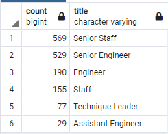

# Pewlett-Hackard-Analysis

## Overview
Use a given set of Pwelett Hackard's employee/HR CSV,
- Determine the number of retiring employees per title, and 
- Identify employees who are eligible to participate in a mentorship program

## Results
The number of staff retiring by title name is shown below: 

The number of staff eligible to become a mentor by title name is shown below: 

