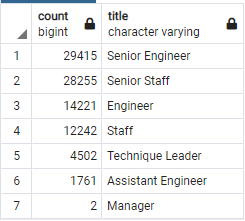

# Pewlett-Hackard-Analysis

## Overview
Use a given set of Pewlett Hackard's employee/HR CSV,
- Determine the number of retiring employees per title, and 
- Identify employees who are eligible to participate in a mentorship program

## Results
### Retiring
- Pewlett Hackard employees are only eligible for retirement if they are born between 1952 and 1955
- Below is summary count of each retirement-eligible employee's <u>current title</u>
  - Current title of the employee was determined by filtering "DISTINCT ON" employee number and where the maximum date of their title's "to_date" .<br>
  
- There are currently 90,398 Pewlett-Hackard employees eligible for retirement, of the company's 300,024 total employee count (30%).

### Mentors
- Pewlett Hackard employees are eligible to become mentors only if their brithdates are between Jan 1 1965 and Dec 31 1965
- The number of staff eligible to become a mentor by title name is shown below:<br>
  - Current title of the employee was determined by filtering "DISTINCT ON" employee number and only where the "to_date" of the employee's current title as after the day of analysis.<br>
  
- With the current mentorship criteria, 1,549 employees are eligible.

## Summary
- Immediate attention is required if the company has not already created a plan for heavily reduced staff counts
  - 90,398 employees will be retiring
    - This consists of 30% of the company's workforce
  - 1,549 employees are eligible to becomee mentors
    - The number of retirees outnumber the number of employees by nearly 60:1.

### Additional Queries
Two additional queries were used to obtain the exact ratio of retirees per mentor
  ```
  select count(title), title into mentor_count from mentorship_eligibility  group by title order by count desc;
  ```
and
  ```
  select ri.count/mc.count  as ret2ment, mc.title
  into retire_to_mentors
  FROM mentor_count as mc
  JOIN retiring_titles as ri on ri.title = mc.title
  ```


Where the "Ret2ment" (Retirees to Mentor) ratio is (at best) 49 retirees to 1 mentor, to (at worst) 78 retirees to 1 mentor.
